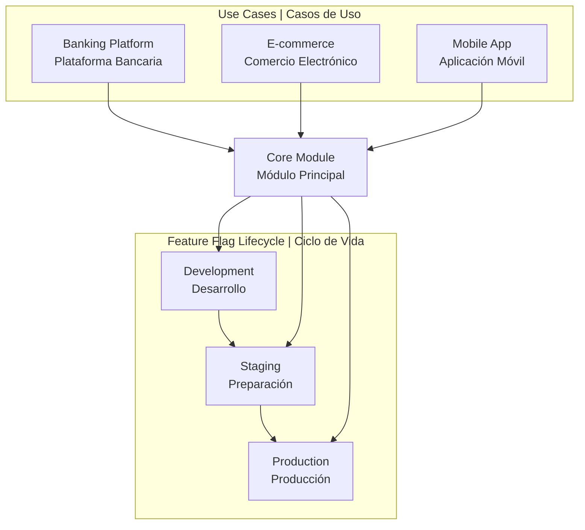

# Split.io Feature Flag Management with Terraform


A comprehensive, production-ready Terraform module for managing Split.io feature flags across multiple environments with advanced lifecycle management, safety controls, and multi-language documentation.

## 🌍 Documentation Languages | Idiomas de Documentación

| Language | Idioma | Documentation | Documentación |
|----------|--------|---------------|---------------|
| 🇺🇸 **English** | **Inglés** | [📖 Full Documentation](docs/en/README.md) | [📖 Documentación Completa](docs/en/README.md) |
| 🇪🇸 **Español** | **Spanish** | [📖 Documentación Completa](docs/es/README.md) | [📖 Full Documentation](docs/es/README.md) |

## 🚀 Quick Start | Inicio Rápido

### English
1. **Choose your use case**: Navigate to [`use-cases/banking-platform/`](use-cases/banking-platform/)
2. **Follow the guide**: Check the [English documentation](docs/en/README.md)
3. **Deploy**: Use the provided Terraform configurations

### Español
1. **Elige tu caso de uso**: Navega a [`use-cases/banking-platform/`](use-cases/banking-platform/)
2. **Sigue la guía**: Consulta la [documentación en español](docs/es/README.md)
3. **Despliega**: Usa las configuraciones de Terraform proporcionadas

## 📊 Visual Overview | Resumen Visual



## 🏗️ Repository Structure | Estructura del Repositorio

```
📁 modules/split-feature-flags/     # Reusable core module | Módulo reutilizable
📁 use-cases/                      # Implementation examples | Ejemplos de implementación
  └── banking-platform/            # Banking use case | Caso de uso bancario
📁 examples/                       # Advanced examples | Ejemplos avanzados
📁 docs/                          # Documentation | Documentación
  ├── en/                         # English docs | Docs en inglés
  ├── es/                         # Spanish docs | Docs en español
  └── diagrams/                   # Visual diagrams | Diagramas visuales
```

## ✨ Key Features | Características Principales

### English
- **🔒 Environment Safety**: Automatic filtering prevents accidental production deployments
- **🚀 Lifecycle Management**: Progressive feature promotion through environments
- **📊 Visual Documentation**: Comprehensive diagrams and examples
- **🔧 Production Ready**: Battle-tested patterns and best practices

### Español
- **🔒 Seguridad de Entornos**: Filtrado automático previene despliegues accidentales en producción
- **🚀 Gestión del Ciclo de Vida**: Promoción progresiva de características a través de entornos
- **📊 Documentación Visual**: Diagramas completos y ejemplos
- **🔧 Listo para Producción**: Patrones probados y mejores prácticas

## 📚 Documentation Structure | Estructura de Documentación

| Section | English | Español |
|---------|---------|---------|
| **Getting Started** | [docs/en/getting-started.md](docs/en/getting-started.md) | [docs/es/primeros-pasos.md](docs/es/primeros-pasos.md) |
| **Architecture** | [docs/en/architecture.md](docs/en/architecture.md) | [docs/es/arquitectura.md](docs/es/arquitectura.md) |
| **Feature Management** | [docs/en/feature-management.md](docs/en/feature-management.md) | [docs/es/gestion-caracteristicas.md](docs/es/gestion-caracteristicas.md) |
| **Use Cases** | [docs/en/use-cases.md](docs/en/use-cases.md) | [docs/es/casos-uso.md](docs/es/casos-uso.md) |
| **Best Practices** | [docs/en/best-practices.md](docs/en/best-practices.md) | [docs/es/mejores-practicas.md](docs/es/mejores-practicas.md) |

## 🎯 Use Cases | Casos de Uso

### Banking Platform | Plataforma Bancaria
- **English**: [Banking Platform Documentation](use-cases/banking-platform/docs/en/README.md)
- **Español**: [Documentación Plataforma Bancaria](use-cases/banking-platform/docs/es/README.md)

## 🔧 Quick Integration Examples | Ejemplos de Integración Rápida

```hcl
module "feature_flags" {
  source = "./modules/split-feature-flags"
  
  workspace_name    = "MyWorkspace"
  environment_name  = "production"
  is_production    = true
  traffic_type_name = "user"
  feature_flags     = var.feature_flags
}
```

## 🤝 Contributing | Contribuir

We welcome contributions in both English and Spanish!
¡Damos la bienvenida a contribuciones tanto en inglés como en español!

- **English**: [Contributing Guide](docs/en/contributing.md)
- **Español**: [Guía de Contribución](docs/es/contribuir.md)

---

**Choose your language to continue | Elige tu idioma para continuar:**

🇺🇸 [**Continue in English**](docs/en/README.md) | 🇪🇸 [**Continúa en Español**](docs/es/README.md)