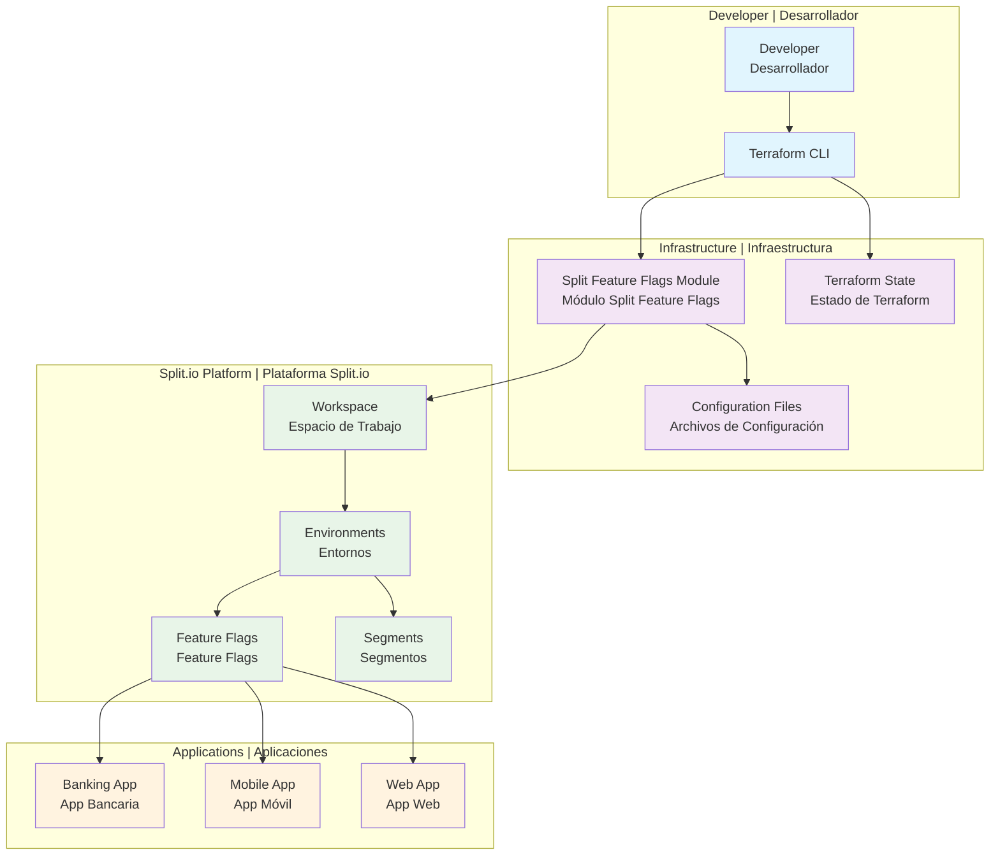
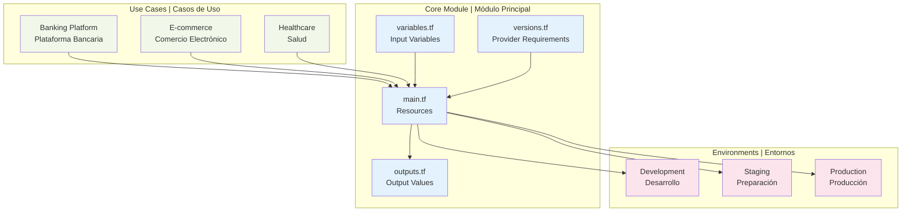
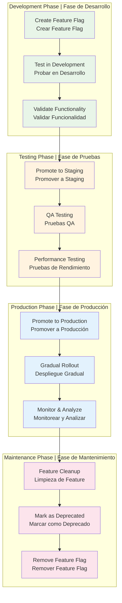
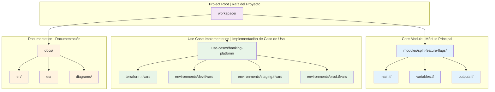
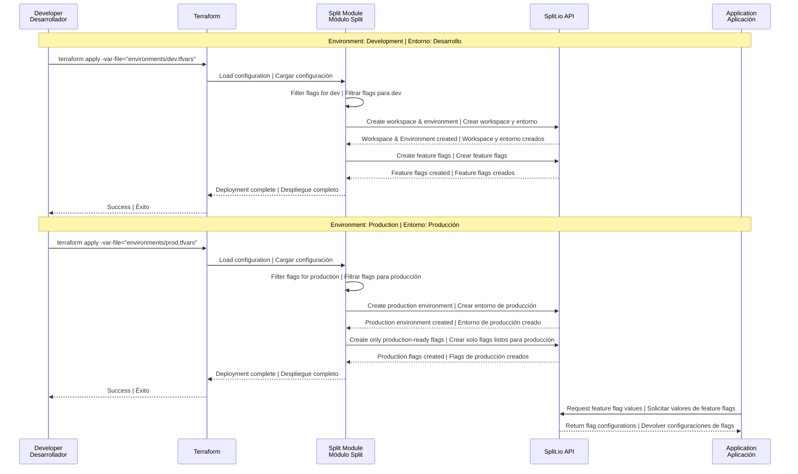

# Architecture Diagrams | Diagramas de Arquitectura

## Overall System Architecture | Arquitectura General del Sistema



## Module Architecture | Arquitectura del Módulo



## Feature Flag Lifecycle Flow | Flujo del Ciclo de Vida de Feature Flags



## Environment Filtering Logic | Lógica de Filtrado de Entornos

```mermaid
graph TB
    subgraph "Feature Flag Definition | Definición de Feature Flag"
        FF_CONFIG[Feature Flag Configuration<br/>Configuración de Feature Flag]
        ENV_LIST[environments: [dev, staging, prod]<br/>entornos: [dev, staging, prod]]
    end
    
    subgraph "Environment Filter | Filtro de Entorno"
        CURRENT_ENV[Current Environment<br/>Entorno Actual]
        FILTER_LOGIC[Filtering Logic<br/>Lógica de Filtrado]
    end
    
    subgraph "Deployment Results | Resultados de Despliegue"
        DEV_RESULT[Development: ✅ Deploy<br/>Desarrollo: ✅ Desplegar]
        STAGING_RESULT[Staging: ✅ Deploy<br/>Staging: ✅ Desplegar]
        PROD_RESULT[Production: ✅ Deploy<br/>Producción: ✅ Desplegar]
    end
    
    subgraph "Safety Examples | Ejemplos de Seguridad"
        EXPERIMENTAL[Experimental Feature<br/>Feature Experimental]
        EXP_ENV[environments: [dev]<br/>entornos: [dev]]
        EXP_DEV[Development: ✅<br/>Desarrollo: ✅]
        EXP_STAGING[Staging: ❌<br/>Staging: ❌]
        EXP_PROD[Production: ❌<br/>Producción: ❌]
    end
    
    FF_CONFIG --> ENV_LIST
    ENV_LIST --> FILTER_LOGIC
    CURRENT_ENV --> FILTER_LOGIC
    
    FILTER_LOGIC --> DEV_RESULT
    FILTER_LOGIC --> STAGING_RESULT
    FILTER_LOGIC --> PROD_RESULT
    
    EXPERIMENTAL --> EXP_ENV
    EXP_ENV --> EXP_DEV
    EXP_ENV --> EXP_STAGING
    EXP_ENV --> EXP_PROD
    
    classDef configClass fill:#e3f2fd
    classDef filterClass fill:#fff3e0
    classDef resultClass fill:#e8f5e8
    classDef safetyClass fill:#ffebee
    
    class FF_CONFIG,ENV_LIST configClass
    class CURRENT_ENV,FILTER_LOGIC filterClass
    class DEV_RESULT,STAGING_RESULT,PROD_RESULT resultClass
    class EXPERIMENTAL,EXP_ENV,EXP_DEV,EXP_STAGING,EXP_PROD safetyClass
```

## File Structure Flow | Flujo de Estructura de Archivos



## Deployment Workflow | Flujo de Trabajo de Despliegue

