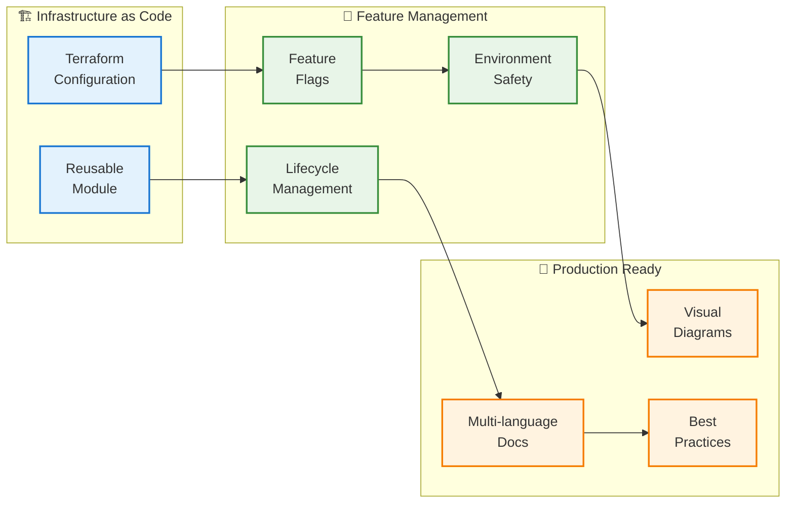

# Split.io Feature Flag Management Banner

```mermaid
graph LR
    subgraph "🏗️ Infrastructure as Code"
        TF[Terraform<br/>Configuration]
        MODULE[Reusable<br/>Module]
    end
    
    subgraph "🎯 Feature Management"
        FF[Feature<br/>Flags]
        LC[Lifecycle<br/>Management]
        ENV[Environment<br/>Safety]
    end
    
    subgraph "🚀 Production Ready"
        MULTI[Multi-language<br/>Docs]
        VISUAL[Visual<br/>Diagrams]
        BP[Best<br/>Practices]
    end
    
    TF --> FF
    MODULE --> LC
    FF --> ENV
    LC --> MULTI
    ENV --> VISUAL
    MULTI --> BP
    
    classDef infraClass fill:#e3f2fd,stroke:#1976d2,stroke-width:2px
    classDef featureClass fill:#e8f5e8,stroke:#388e3c,stroke-width:2px
    classDef prodClass fill:#fff3e0,stroke:#f57c00,stroke-width:2px
    
    class TF,MODULE infraClass
    class FF,LC,ENV featureClass
    class MULTI,VISUAL,BP prodClass
```