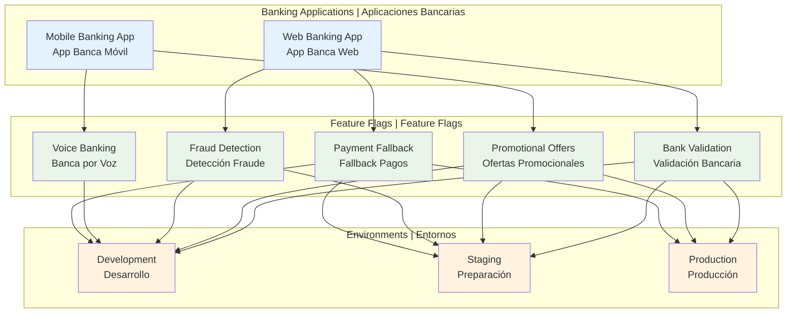

# Banking Platform - Split.io Feature Flags Implementation


## 🌍 Documentation Languages | Idiomas de Documentación

| Language | Idioma | Quick Start | Inicio Rápido |
|----------|--------|-------------|---------------|
| 🇺🇸 **English** | **Inglés** | [📖 Full Documentation](docs/en/README.md) | [📖 Documentación Completa](docs/en/README.md) |
| 🇪🇸 **Español** | **Spanish** | [📖 Documentación Completa](docs/es/README.md) | [📖 Full Documentation](docs/es/README.md) |

## 🚀 Quick Overview | Resumen Rápido

### English
A comprehensive implementation of Split.io feature flags for a banking platform, showcasing real-world scenarios including transaction validation, promotional offers, fraud detection, and operational controls with progressive environment deployment and safety controls.

### Español
Una implementación completa de feature flags de Split.io para una plataforma bancaria, mostrando escenarios del mundo real incluyendo validación de transacciones, ofertas promocionales, detección de fraude y controles operacionales con despliegue progresivo de entornos y controles de seguridad.

## 🎯 Feature Flags Included | Feature Flags Incluidos

| Feature Flag | Purpose | Propósito | Environments | Entornos |
|-------------|---------|-----------|--------------|----------|
| `bankvalidation` | Transaction validation | Validación de transacciones | dev, staging, prod | dev, staging, prod |
| `harnessoffer` | Promotional offers | Ofertas promocionales | dev, staging, prod | dev, staging, prod |
| `advanced-fraud-detection` | AI fraud detection | Detección de fraude IA | dev, staging | dev, staging |
| `voice-banking-beta` | Voice banking commands | Comandos banca por voz | dev | dev |
| `payment-gateway-fallback` | Payment fallback control | Control fallback de pagos | dev, staging, prod | dev, staging, prod |

## 🔧 Quick Start | Inicio Rápido

### Prerequisites | Prerequisitos
- Terraform >= 1.5
- Split.io account | Cuenta de Split.io
- API key | Clave API

### Deploy | Desplegar

```bash
# Navigate to banking platform | Navegar a plataforma bancaria
cd use-cases/banking-platform

# Initialize Terraform | Inicializar Terraform
terraform init

# Deploy to development | Desplegar a desarrollo
terraform apply -var-file="environments/dev.tfvars" -var="split_api_key=your-key"

# Deploy to staging | Desplegar a staging
terraform apply -var-file="environments/staging.tfvars" -var="split_api_key=your-key"

# Deploy to production | Desplegar a producción
terraform apply -var-file="environments/prod.tfvars" -var="split_api_key=your-key"
```

## 🛡️ Environment Safety | Seguridad de Entornos

The system automatically filters feature flags based on environment to prevent accidental production deployments of experimental features.

El sistema filtra automáticamente los feature flags basado en el entorno para prevenir despliegues accidentales en producción de características experimentales.

| Feature | Dev | Staging | Prod | Reason | Razón |
|---------|-----|---------|------|--------|--------|
| Voice Banking | ✅ | ❌ | ❌ | Experimental | Experimental |
| Fraud Detection | ✅ | ✅ | ❌ | Testing phase | Fase de pruebas |
| Bank Validation | ✅ | ✅ | ✅ | Production ready | Listo para producción |

## 📊 Architecture Overview | Resumen de Arquitectura



## 📚 Complete Documentation | Documentación Completa

### English Documentation
- [**Complete Banking Platform Guide**](docs/en/README.md) - Comprehensive implementation guide
- [**Getting Started**](../../docs/en/getting-started.md) - Quick setup tutorial
- [**Architecture Deep Dive**](../../docs/en/architecture.md) - System design details
- [**Best Practices**](../../docs/en/best-practices.md) - Production-ready patterns

### Documentación en Español
- [**Guía Completa de Plataforma Bancaria**](docs/es/README.md) - Guía de implementación completa
- [**Primeros Pasos**](../../docs/es/primeros-pasos.md) - Tutorial de configuración rápida
- [**Análisis Profundo de Arquitectura**](../../docs/es/arquitectura.md) - Detalles de diseño del sistema
- [**Mejores Prácticas**](../../docs/es/mejores-practicas.md) - Patrones listos para producción

## 🔗 Related Resources | Recursos Relacionados

- [Core Module Documentation](../../modules/split-feature-flags/README.md) | [Documentación del Módulo Principal](../../modules/split-feature-flags/README.md)
- [Split.io Documentation](https://help.split.io/) | [Documentación de Split.io](https://help.split.io/)
- [Terraform Provider](https://registry.terraform.io/providers/davidji99/split/latest) | [Proveedor de Terraform](https://registry.terraform.io/providers/davidji99/split/latest)

---

**Choose your language to continue | Elige tu idioma para continuar:**

🇺🇸 [**Continue in English**](docs/en/README.md) | 🇪🇸 [**Continúa en Español**](docs/es/README.md)