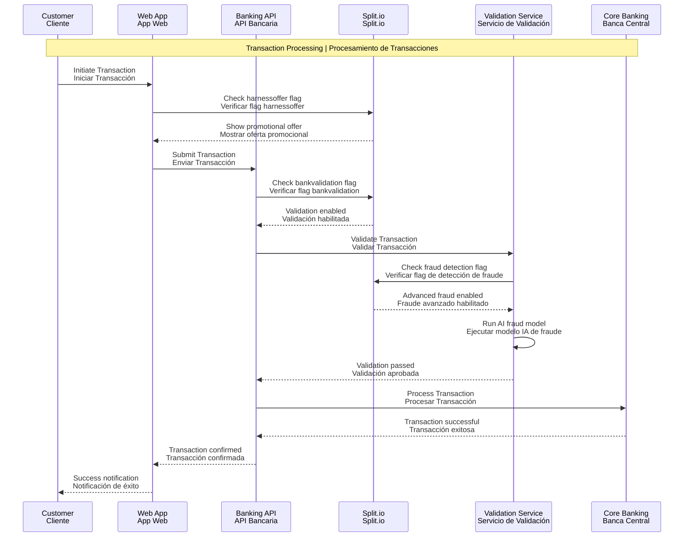
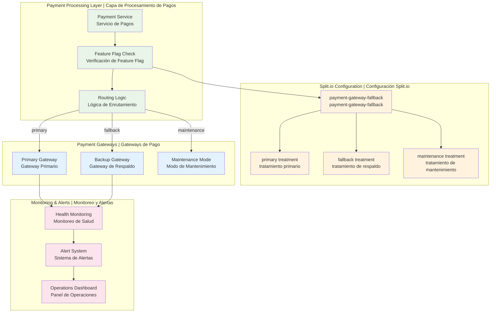
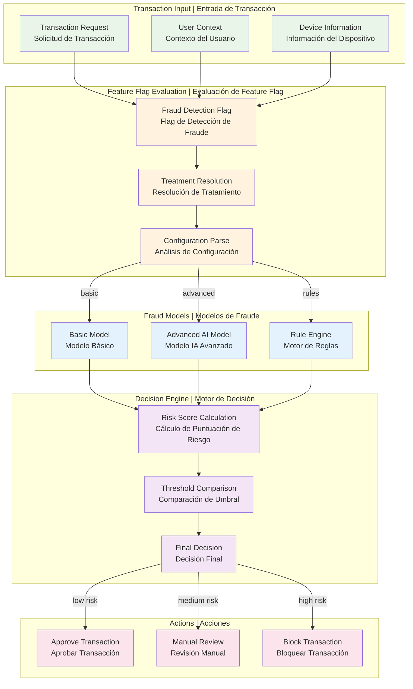

# Banking Platform Architecture Diagrams

## Banking System Overview

```mermaid
graph TB
    subgraph "Customer Interfaces | Interfaces de Cliente"
        WEB[Web Banking<br/>Banca Web]
        MOBILE[Mobile App<br/>App Móvil]
        ATM[ATM Network<br/>Red de Cajeros]
        VOICE[Voice Banking<br/>Banca por Voz]
    end
    
    subgraph "API Gateway Layer | Capa de Gateway API"
        GATEWAY[Banking API Gateway<br/>Gateway API Bancario]
        AUTH[Authentication Service<br/>Servicio de Autenticación]
        RATE_LIMIT[Rate Limiting<br/>Limitación de Velocidad]
    end
    
    subgraph "Core Banking Services | Servicios Bancarios Centrales"
        ACCOUNT[Account Service<br/>Servicio de Cuentas]
        TRANSACTION[Transaction Service<br/>Servicio de Transacciones]
        VALIDATION[Validation Service<br/>Servicio de Validación]
        FRAUD[Fraud Detection<br/>Detección de Fraude]
        PAYMENT[Payment Gateway<br/>Gateway de Pagos]
    end
    
    subgraph "Feature Flag Management | Gestión de Feature Flags"
        SPLIT_WS[Split.io Workspace<br/>Espacio de Trabajo Split.io]
        FF_BANK[bankvalidation]
        FF_OFFER[harnessoffer]
        FF_FRAUD[advanced-fraud-detection]
        FF_VOICE[voice-banking-beta]
        FF_PAYMENT[payment-gateway-fallback]
    end
    
    subgraph "External Systems | Sistemas Externos"
        CORE_BANK[Core Banking System<br/>Sistema Bancario Central]
        CREDIT[Credit Bureau<br/>Buró de Crédito]
        COMPLIANCE[Compliance System<br/>Sistema de Cumplimiento]
        BACKUP_PAY[Backup Payment<br/>Pago de Respaldo]
    end
    
    WEB --> GATEWAY
    MOBILE --> GATEWAY
    ATM --> GATEWAY
    VOICE --> GATEWAY
    
    GATEWAY --> AUTH
    GATEWAY --> RATE_LIMIT
    GATEWAY --> ACCOUNT
    GATEWAY --> TRANSACTION
    
    TRANSACTION --> VALIDATION
    TRANSACTION --> FRAUD
    TRANSACTION --> PAYMENT
    
    VALIDATION -.->|Feature Flags| FF_BANK
    WEB -.->|Feature Flags| FF_OFFER
    FRAUD -.->|Feature Flags| FF_FRAUD
    VOICE -.->|Feature Flags| FF_VOICE
    PAYMENT -.->|Feature Flags| FF_PAYMENT
    
    SPLIT_WS --> FF_BANK
    SPLIT_WS --> FF_OFFER
    SPLIT_WS --> FF_FRAUD
    SPLIT_WS --> FF_VOICE
    SPLIT_WS --> FF_PAYMENT
    
    VALIDATION --> CORE_BANK
    FRAUD --> CREDIT
    ACCOUNT --> COMPLIANCE
    PAYMENT --> BACKUP_PAY
    
    classDef interfaceClass fill:#e3f2fd
    classDef gatewayClass fill:#f3e5f5
    classDef serviceClass fill:#e8f5e8
    classDef featureFlagClass fill:#fff3e0
    classDef externalClass fill:#fce4ec
    
    class WEB,MOBILE,ATM,VOICE interfaceClass
    class GATEWAY,AUTH,RATE_LIMIT gatewayClass
    class ACCOUNT,TRANSACTION,VALIDATION,FRAUD,PAYMENT serviceClass
    class SPLIT_WS,FF_BANK,FF_OFFER,FF_FRAUD,FF_VOICE,FF_PAYMENT featureFlagClass
    class CORE_BANK,CREDIT,COMPLIANCE,BACKUP_PAY externalClass
```

## Feature Flag Integration Flow

## Environment Safety Model

```mermaid
graph TB
    subgraph "Development Environment | Entorno de Desarrollo"
        DEV_ALL[All Features Available<br/>Todas las Características Disponibles]
        DEV_BANK[✅ bankvalidation]
        DEV_OFFER[✅ harnessoffer]
        DEV_FRAUD[✅ advanced-fraud-detection]
        DEV_VOICE[✅ voice-banking-beta]
        DEV_PAY[✅ payment-gateway-fallback]
    end
    
    subgraph "Staging Environment | Entorno de Staging"
        STAGE_READY[Staging-Ready Features<br/>Características Listas para Staging]
        STAGE_BANK[✅ bankvalidation]
        STAGE_OFFER[✅ harnessoffer]
        STAGE_FRAUD[✅ advanced-fraud-detection]
        STAGE_VOICE[❌ voice-banking-beta]
        STAGE_PAY[✅ payment-gateway-fallback]
    end
    
    subgraph "Production Environment | Entorno de Producción"
        PROD_SAFE[Production-Safe Features<br/>Características Seguras para Producción]
        PROD_BANK[✅ bankvalidation]
        PROD_OFFER[✅ harnessoffer]
        PROD_FRAUD[❌ advanced-fraud-detection]
        PROD_VOICE[❌ voice-banking-beta]
        PROD_PAY[✅ payment-gateway-fallback]
    end
    
    subgraph "Safety Controls | Controles de Seguridad"
        FILTER[Environment Filter<br/>Filtro de Entorno]
        VALIDATE[Validation Rules<br/>Reglas de Validación]
        AUDIT[Audit Trail<br/>Rastro de Auditoría]
    end
    
    DEV_ALL --> FILTER
    STAGE_READY --> FILTER
    PROD_SAFE --> FILTER
    
    FILTER --> VALIDATE
    VALIDATE --> AUDIT
    
    DEV_ALL --> DEV_BANK
    DEV_ALL --> DEV_OFFER
    DEV_ALL --> DEV_FRAUD
    DEV_ALL --> DEV_VOICE
    DEV_ALL --> DEV_PAY
    
    STAGE_READY --> STAGE_BANK
    STAGE_READY --> STAGE_OFFER
    STAGE_READY --> STAGE_FRAUD
    STAGE_READY --> STAGE_PAY
    
    PROD_SAFE --> PROD_BANK
    PROD_SAFE --> PROD_OFFER
    PROD_SAFE --> PROD_PAY
    
    classDef devClass fill:#e8f5e8
    classDef stageClass fill:#fff3e0
    classDef prodClass fill:#e3f2fd
    classDef safetyClass fill:#ffebee
    classDef enabledClass fill:#c8e6c9
    classDef disabledClass fill:#ffcdd2
    
    class DEV_ALL,DEV_BANK,DEV_OFFER,DEV_FRAUD,DEV_VOICE,DEV_PAY devClass
    class STAGE_READY,STAGE_BANK,STAGE_OFFER,STAGE_FRAUD,STAGE_PAY stageClass
    class PROD_SAFE,PROD_BANK,PROD_OFFER,PROD_PAY prodClass
    class FILTER,VALIDATE,AUDIT safetyClass
```

## Feature Flag Lifecycle in Banking Context

```mermaid
graph TB
    subgraph "Development Phase | Fase de Desarrollo"
        CREATE[Create Banking Feature<br/>Crear Característica Bancaria]
        DEV_TEST[Internal Testing<br/>Pruebas Internas]
        SECURITY[Security Review<br/>Revisión de Seguridad]
    end
    
    subgraph "Compliance Phase | Fase de Cumplimiento"
        COMPLIANCE[Compliance Check<br/>Verificación de Cumplimiento]
        AUDIT[Audit Preparation<br/>Preparación de Auditoría]
        REGULATORY[Regulatory Approval<br/>Aprobación Regulatoria]
    end
    
    subgraph "Testing Phase | Fase de Pruebas"
        QA[QA Testing<br/>Pruebas QA]
        LOAD[Load Testing<br/>Pruebas de Carga]
        PENETRATION[Security Testing<br/>Pruebas de Seguridad]
    end
    
    subgraph "Production Phase | Fase de Producción"
        PILOT[Pilot Group<br/>Grupo Piloto]
        GRADUAL[Gradual Rollout<br/>Despliegue Gradual]
        FULL[Full Deployment<br/>Despliegue Completo]
    end
    
    subgraph "Monitoring Phase | Fase de Monitoreo"
        MONITOR[Continuous Monitoring<br/>Monitoreo Continuo]
        INCIDENT[Incident Response<br/>Respuesta a Incidentes]
        OPTIMIZE[Performance Optimization<br/>Optimización de Rendimiento]
    end
    
    CREATE --> DEV_TEST
    DEV_TEST --> SECURITY
    SECURITY --> COMPLIANCE
    
    COMPLIANCE --> AUDIT
    AUDIT --> REGULATORY
    REGULATORY --> QA
    
    QA --> LOAD
    LOAD --> PENETRATION
    PENETRATION --> PILOT
    
    PILOT --> GRADUAL
    GRADUAL --> FULL
    FULL --> MONITOR
    
    MONITOR --> INCIDENT
    INCIDENT --> OPTIMIZE
    OPTIMIZE --> MONITOR
    
    classDef devPhase fill:#e8f5e8
    classDef compliancePhase fill:#e3f2fd
    classDef testPhase fill:#fff3e0
    classDef prodPhase fill:#f3e5f5
    classDef monitorPhase fill:#fce4ec
    
    class CREATE,DEV_TEST,SECURITY devPhase
    class COMPLIANCE,AUDIT,REGULATORY compliancePhase
    class QA,LOAD,PENETRATION testPhase
    class PILOT,GRADUAL,FULL prodPhase
    class MONITOR,INCIDENT,OPTIMIZE monitorPhase
```

## Payment Gateway Fallback Architecture

## Fraud Detection Integration

