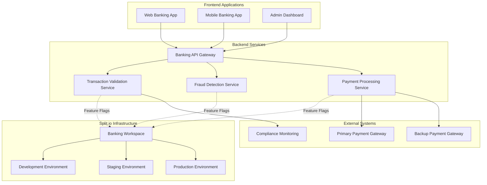
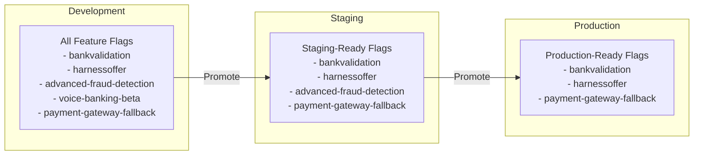

# Banking Platform - Feature Flag Implementation


This use case demonstrates a comprehensive implementation of Split.io feature flags for a banking platform, showcasing real-world scenarios including transaction validation, promotional offers, fraud detection, and operational controls.

## 📋 Table of Contents

1. [Overview](#overview)
2. [Feature Flags](#feature-flags)
3. [Architecture](#architecture)
4. [Quick Start](#quick-start)
5. [Environment Management](#environment-management)
6. [Advanced Configuration](#advanced-configuration)
7. [Monitoring and Analytics](#monitoring-and-analytics)
8. [Best Practices](#best-practices)

## 🏦 Overview

The banking platform implementation includes:

### Business Features
- **Transaction Validation**: Backend validation for financial transactions
- **Promotional Offers**: Frontend promotional campaigns management
- **Fraud Detection**: AI-powered fraud detection system
- **Voice Banking**: Experimental voice-activated banking commands

### Operational Features
- **Payment Gateway Fallback**: Emergency payment system switching
- **System Monitoring**: Performance and health monitoring toggles
- **Compliance Controls**: Regulatory compliance feature switches

### Architecture Benefits
- **Environment Safety**: Prevents experimental features in production
- **Progressive Rollout**: Gradual feature deployment across environments
- **Risk Management**: Safe rollback capabilities for critical systems
- **Compliance Ready**: Audit trails and regulatory compliance support

## 🎯 Feature Flags

### Production-Ready Features

#### 1. Bank Validation (`bankvalidation`)
**Purpose**: Controls transaction validation logic in the backend system.

```hcl
{
  name              = "bankvalidation"
  description       = "Backend transaction validation system"
  default_treatment = "off"
  environments      = ["dev", "staging", "prod"]
  lifecycle_stage   = "production"
  category          = "feature"
  treatments = [
    {
      name           = "off"
      configurations = "{\"validation\": false}"
      description    = "Validation disabled"
    },
    {
      name           = "on"
      configurations = "{\"validation\": true, \"strict\": true}"
      description    = "Strict validation enabled"
    }
  ]
  rules = [
    {
      condition = {
        matcher = {
          type      = "EQUAL_SET"
          attribute = "customerID"
          strings   = ["user123"]
        }
      }
    }
  ]
}
```

**Implementation Example**:
```javascript
// Backend validation service
const isValidationEnabled = await splitClient.getTreatment('customerID', 'bankvalidation');
if (isValidationEnabled === 'on') {
  const config = JSON.parse(splitClient.getTreatmentWithConfig('customerID', 'bankvalidation').config);
  if (config.strict) {
    // Perform strict validation
    validateTransactionStrict(transaction);
  } else {
    // Perform basic validation
    validateTransactionBasic(transaction);
  }
}
```

#### 2. Harness Offer (`harnessoffer`)
**Purpose**: Controls promotional offer display in the frontend application.

```hcl
{
  name              = "harnessoffer"
  description       = "Frontend promotional offers system"
  default_treatment = "off"
  environments      = ["dev", "staging", "prod"]
  lifecycle_stage   = "production"
  category          = "feature"
  treatments = [
    {
      name           = "off"
      configurations = "{\"showOffer\": false}"
      description    = "Offers disabled"
    },
    {
      name           = "standard"
      configurations = "{\"showOffer\": true, \"offerType\": \"standard\"}"
      description    = "Standard promotional offers"
    },
    {
      name           = "premium"
      configurations = "{\"showOffer\": true, \"offerType\": \"premium\", \"discount\": 0.15}"
      description    = "Premium offers with 15% discount"
    }
  ]
  rules = []
}
```

**Implementation Example**:
```react
// React component for promotional offers
const PromotionalOffer = ({ customerId }) => {
  const [treatment, setTreatment] = useState('off');
  const [config, setConfig] = useState({});

  useEffect(() => {
    const result = splitClient.getTreatmentWithConfig(customerId, 'harnessoffer');
    setTreatment(result.treatment);
    setConfig(JSON.parse(result.config || '{}'));
  }, [customerId]);

  if (!config.showOffer) return null;

  return (
    <div className="promotional-offer">
      {config.offerType === 'premium' ? (
        <PremiumOffer discount={config.discount} />
      ) : (
        <StandardOffer />
      )}
    </div>
  );
};
```

### Testing Phase Features

#### 3. Advanced Fraud Detection (`advanced-fraud-detection`)
**Purpose**: AI-powered fraud detection system currently in testing phase.

```hcl
{
  name              = "advanced-fraud-detection"
  description       = "AI-powered fraud detection system"
  default_treatment = "off"
  environments      = ["dev", "staging"]  # Not in production yet
  lifecycle_stage   = "testing"
  category          = "feature"
  treatments = [
    {
      name           = "off"
      configurations = "{\"enabled\": false}"
      description    = "AI fraud detection disabled"
    },
    {
      name           = "basic"
      configurations = "{\"enabled\": true, \"model\": \"basic\", \"threshold\": 0.7}"
      description    = "Basic AI fraud detection"
    },
    {
      name           = "advanced"
      configurations = "{\"enabled\": true, \"model\": \"advanced\", \"threshold\": 0.85}"
      description    = "Advanced AI fraud detection with higher sensitivity"
    }
  ]
  rules = [
    {
      treatment = "basic"
      size      = 50
      condition = {
        matcher = {
          type      = "IN_SEGMENT"
          attribute = "user_segment"
          strings   = ["internal_users"]
        }
      }
    }
  ]
}
```

**Implementation Example**:
```python
# Python fraud detection service
async def process_transaction(transaction, user_id):
    fraud_check = await split_client.get_treatment_with_config(user_id, 'advanced-fraud-detection')
    
    if fraud_check.treatment != 'off':
        config = json.loads(fraud_check.config)
        model_type = config.get('model', 'basic')
        threshold = config.get('threshold', 0.7)
        
        if model_type == 'advanced':
            risk_score = await advanced_fraud_model.predict(transaction)
        else:
            risk_score = await basic_fraud_model.predict(transaction)
        
        if risk_score > threshold:
            return await flag_transaction_for_review(transaction)
    
    return await process_transaction_normally(transaction)
```

### Experimental Features

#### 4. Voice Banking Beta (`voice-banking-beta`)
**Purpose**: Experimental voice-activated banking commands (development only).

```hcl
{
  name              = "voice-banking-beta"
  description       = "Voice-activated banking commands (experimental)"
  default_treatment = "off"
  environments      = ["dev"]  # Development only
  lifecycle_stage   = "development"
  category          = "experiment"
  treatments = [
    {
      name           = "off"
      configurations = "{\"voice_enabled\": false}"
      description    = "Voice banking disabled"
    },
    {
      name           = "on"
      configurations = "{\"voice_enabled\": true, \"commands\": [\"balance\", \"transfer\"]}"
      description    = "Voice banking enabled with basic commands"
    }
  ]
  rules = []
}
```

### Operational Features

#### 5. Payment Gateway Fallback (`payment-gateway-fallback`)
**Purpose**: Emergency control for payment gateway issues.

```hcl
{
  name              = "payment-gateway-fallback"
  description       = "Emergency fallback for payment gateway issues"
  default_treatment = "primary"
  environments      = ["dev", "staging", "prod"]
  lifecycle_stage   = "production"
  category          = "killswitch"
  treatments = [
    {
      name           = "primary"
      configurations = "{\"gateway\": \"primary\", \"timeout\": 30}"
      description    = "Use primary payment gateway"
    },
    {
      name           = "fallback"
      configurations = "{\"gateway\": \"fallback\", \"timeout\": 45}"
      description    = "Use fallback payment gateway"
    },
    {
      name           = "maintenance"
      configurations = "{\"gateway\": \"none\", \"message\": \"Payments temporarily unavailable\"}"
      description    = "Payments in maintenance mode"
    }
  ]
  rules = []
}
```

## 🏗️ Architecture

### System Components



### Environment Flow



## 🚀 Quick Start

### Prerequisites
- Terraform >= 1.5
- Split.io account with banking workspace
- API key with appropriate permissions

### 1. Navigate to Banking Platform
```bash
cd use-cases/banking-platform
```

### 2. Configure Environment
```bash
export TF_VAR_split_api_key="your-split-io-api-key"
```

### 3. Deploy to Development
```bash
terraform init
terraform apply -var-file="environments/dev.tfvars"
```

### 4. Verify Deployment
Check your Split.io dashboard for:
- Banking workspace
- Development environment
- All 5 feature flags created

### 5. Deploy to Additional Environments
```bash
# Staging (excludes dev-only features)
terraform apply -var-file="environments/staging.tfvars"

# Production (only production-ready features)
terraform apply -var-file="environments/prod.tfvars"
```

## 🌍 Environment Management

### Environment Safety Matrix

| Feature Flag | Development | Staging | Production | Notes |
|-------------|------------|---------|------------|-------|
| `bankvalidation` | ✅ | ✅ | ✅ | Production-ready validation |
| `harnessoffer` | ✅ | ✅ | ✅ | Promotional system |
| `advanced-fraud-detection` | ✅ | ✅ | ❌ | Still in testing |
| `voice-banking-beta` | ✅ | ❌ | ❌ | Experimental only |
| `payment-gateway-fallback` | ✅ | ✅ | ✅ | Critical operational control |

### Deployment Commands

```bash
# Development - All features available
terraform apply \
  -var-file="environments/dev.tfvars" \
  -var="split_api_key=$TF_VAR_split_api_key"

# Staging - Production candidates only
terraform apply \
  -var-file="environments/staging.tfvars" \
  -var="split_api_key=$TF_VAR_split_api_key"

# Production - Stable features only
terraform apply \
  -var-file="environments/prod.tfvars" \
  -var="split_api_key=$TF_VAR_split_api_key"
```

### Configuration Files

#### Main Configuration (`terraform.tfvars`)
Contains all feature flag definitions and workspace settings.

#### Environment-Specific Files
- `environments/dev.tfvars`: Development settings
- `environments/staging.tfvars`: Staging settings  
- `environments/prod.tfvars`: Production settings

## ⚙️ Advanced Configuration

### Custom Targeting Rules

#### Customer Segment Targeting
```hcl
rules = [
  {
    treatment = "premium"
    size      = 100
    condition = {
      matcher = {
        type      = "IN_SEGMENT"
        attribute = "customer_tier"
        strings   = ["premium", "platinum"]
      }
    }
  }
]
```

#### Geographic Targeting
```hcl
rules = [
  {
    treatment = "regional_features"
    size      = 100
    condition = {
      matcher = {
        type      = "IN_SEGMENT"
        attribute = "country"
        strings   = ["US", "CA", "UK"]
      }
    }
  }
]
```

#### A/B Testing Configuration
```hcl
rules = [
  {
    treatment = "variant_a"
    size      = 50
  },
  {
    treatment = "variant_b"
    size      = 50
  }
]
```

### Feature Flag Promotion Workflow

#### 1. Development Phase
```hcl
{
  name = "new-banking-feature"
  environments = ["dev"]
  lifecycle_stage = "development"
  category = "feature"
}
```

#### 2. Testing Phase
```hcl
{
  name = "new-banking-feature"
  environments = ["dev", "staging"]
  lifecycle_stage = "testing"
  category = "feature"
}
```

#### 3. Production Phase
```hcl
{
  name = "new-banking-feature"
  environments = ["dev", "staging", "prod"]
  lifecycle_stage = "production"
  category = "feature"
}
```

## 📊 Monitoring and Analytics

### Key Metrics to Track

#### Feature Flag Performance
- **Evaluation latency**: Time to evaluate feature flags
- **Cache hit rates**: SDK cache performance
- **Error rates**: Failed evaluations

#### Business Metrics
- **Conversion rates**: Feature impact on conversions
- **User engagement**: Feature usage patterns
- **Revenue impact**: Financial impact of features

### Monitoring Setup

#### Application-Level Monitoring
```javascript
// Track feature flag impressions
splitClient.track('user123', 'feature_viewed', {
  feature: 'harnessoffer',
  treatment: 'premium'
});

// Track business events
splitClient.track('user123', 'transaction_completed', {
  amount: 1000,
  currency: 'USD',
  validation_enabled: isValidationOn
});
```

#### Infrastructure Monitoring
```yaml
# Prometheus metrics example
split_evaluations_total{feature="bankvalidation",treatment="on"} 1500
split_evaluation_latency_seconds{feature="bankvalidation"} 0.002
split_cache_hits_total{feature="bankvalidation"} 1450
```

### Alerting Setup

#### Critical Feature Flags
Set up alerts for:
- Payment gateway fallback activations
- Fraud detection threshold breaches
- Validation system failures

#### Performance Alerts
Monitor:
- Feature flag evaluation latency
- SDK connection issues
- Cache performance degradation

## 💡 Best Practices

### 1. Feature Flag Naming
- Use descriptive, business-oriented names
- Include system or service prefix
- Avoid technical jargon in names

### 2. Lifecycle Management
- Start features in development
- Progress through environments gradually
- Plan deprecation timeline

### 3. Security Considerations
- Use different API keys per environment
- Implement proper access controls
- Regular security audits

### 4. Performance Optimization
- Implement proper caching strategies
- Monitor evaluation performance
- Use asynchronous evaluations where possible

### 5. Business Alignment
- Align feature flags with business objectives
- Include stakeholders in flag planning
- Document business impact

## 🔗 Integration Examples

### Node.js Backend Integration
```javascript
const SplitFactory = require('@splitsoftware/splitio').SplitFactory;

// Initialize Split SDK
const factory = SplitFactory({
  core: {
    authorizationKey: process.env.SPLIT_API_KEY,
    key: 'backend-service'
  }
});

const client = factory.client();

// Transaction validation example
app.post('/api/transactions', async (req, res) => {
  const { customerId, transaction } = req.body;
  
  const validation = await client.getTreatmentWithConfig(customerId, 'bankvalidation');
  
  if (validation.treatment === 'on') {
    const config = JSON.parse(validation.config);
    const isValid = await validateTransaction(transaction, config);
    
    if (!isValid) {
      return res.status(400).json({ error: 'Transaction validation failed' });
    }
  }
  
  // Process transaction
  const result = await processTransaction(transaction);
  res.json(result);
});
```

### React Frontend Integration
```jsx
import { useSplitTreatments } from '@splitsoftware/splitio-react';

const BankingDashboard = ({ customerId }) => {
  const { treatments, isReady } = useSplitTreatments({
    splitNames: ['harnessoffer', 'voice-banking-beta'],
    attributes: { customerId }
  });

  if (!isReady) return <Loading />;

  return (
    <div className="banking-dashboard">
      <AccountBalance />
      <TransactionHistory />
      
      {treatments.harnessoffer.treatment !== 'off' && (
        <PromotionalOffers config={treatments.harnessoffer.config} />
      )}
      
      {treatments['voice-banking-beta'].treatment === 'on' && (
        <VoiceBankingInterface />
      )}
    </div>
  );
};
```

## 🆘 Troubleshooting

### Common Issues

#### 1. Feature Flag Not Appearing in Environment
**Problem**: Feature flag created but not visible in expected environment.
**Solution**: Check the `environments` array in feature flag configuration.

#### 2. Targeting Rules Not Working
**Problem**: Targeting rules not evaluating correctly.
**Solution**: Verify attribute names and values match your application data.

#### 3. Performance Issues
**Problem**: Slow feature flag evaluations.
**Solution**: Check SDK configuration, implement caching, verify network connectivity.

### Debug Commands
```bash
# Validate Terraform configuration
terraform validate

# Check planned changes
terraform plan -var-file="environments/dev.tfvars"

# View current state
terraform show

# Check outputs
terraform output
```

### Split.io Dashboard Verification
1. **Workspace**: Verify correct workspace is selected
2. **Environment**: Check environment-specific views
3. **Feature Flags**: Confirm all expected flags are present
4. **Targeting Rules**: Verify rules are configured correctly
5. **Metrics**: Check evaluation metrics for issues

## 🔗 Additional Resources

### Documentation
- [Getting Started Guide](../../../../docs/en/getting-started.md)
- [Architecture Overview](../../../../docs/en/architecture.md)
- [Best Practices](../../../../docs/en/best-practices.md)

### External Resources
- [Split.io Banking Industry Guide](https://www.split.io/industry/financial-services/)
- [Feature Flag Best Practices](https://www.split.io/blog/feature-flag-best-practices/)
- [Terraform Split Provider Documentation](https://registry.terraform.io/providers/davidji99/split/latest/docs)

---

## 🌍 Language Options

- 🇺🇸 **English** (Current)
- 🇪🇸 [Español](../es/README.md)

---

**Ready to explore more?** Choose your next step:

- 🚀 [Deploy to your environment](../../../../docs/en/getting-started.md)
- 🏗️ [Learn about the architecture](../../../../docs/en/architecture.md)
- 💡 [Review best practices](../../../../docs/en/best-practices.md)
- 🌍 [View in Spanish](../es/README.md)