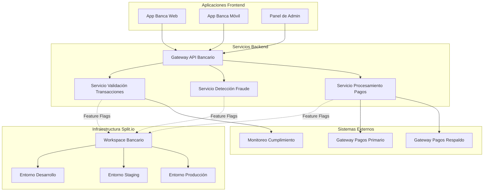

# Plataforma Bancaria - Implementación de Feature Flags


Este caso de uso demuestra una implementación completa de feature flags de Split.io para una plataforma bancaria, mostrando escenarios del mundo real incluyendo validación de transacciones, ofertas promocionales, detección de fraude y controles operacionales.

## 📋 Tabla de Contenidos

1. [Resumen](#resumen)
2. [Feature Flags](#feature-flags)
3. [Arquitectura](#arquitectura)
4. [Inicio Rápido](#inicio-rápido)
5. [Gestión de Entornos](#gestión-de-entornos)
6. [Configuración Avanzada](#configuración-avanzada)
7. [Monitoreo y Analíticas](#monitoreo-y-analíticas)
8. [Mejores Prácticas](#mejores-prácticas)

## 🏦 Resumen

La implementación de plataforma bancaria incluye:

### Características de Negocio
- **Validación de Transacciones**: Validación backend para transacciones financieras
- **Ofertas Promocionales**: Gestión de campañas promocionales frontend
- **Detección de Fraude**: Sistema de detección de fraude potenciado por IA
- **Banca por Voz**: Comandos bancarios experimentales activados por voz

### Características Operacionales
- **Fallback de Gateway de Pagos**: Cambio de sistema de pagos de emergencia
- **Monitoreo del Sistema**: Interruptores de monitoreo de rendimiento y salud
- **Controles de Cumplimiento**: Interruptores de características de cumplimiento regulatorio

### Beneficios de Arquitectura
- **Seguridad de Entornos**: Previene características experimentales en producción
- **Lanzamiento Progresivo**: Despliegue gradual de características a través de entornos
- **Gestión de Riesgos**: Capacidades de rollback seguro para sistemas críticos
- **Listo para Cumplimiento**: Pistas de auditoría y soporte de cumplimiento regulatorio

## 🎯 Feature Flags

### Características Listas para Producción

#### 1. Validación Bancaria (`bankvalidation`)
**Propósito**: Controla la lógica de validación de transacciones en el sistema backend.

```hcl
{
  name              = "bankvalidation"
  description       = "Sistema de validación de transacciones backend"
  default_treatment = "off"
  environments      = ["dev", "staging", "prod"]
  lifecycle_stage   = "production"
  category          = "feature"
  treatments = [
    {
      name           = "off"
      configurations = "{\"validation\": false}"
      description    = "Validación deshabilitada"
    },
    {
      name           = "on"
      configurations = "{\"validation\": true, \"strict\": true}"
      description    = "Validación estricta habilitada"
    }
  ]
  rules = [
    {
      condition = {
        matcher = {
          type      = "EQUAL_SET"
          attribute = "customerID"
          strings   = ["user123"]
        }
      }
    }
  ]
}
```

**Ejemplo de Implementación**:
```javascript
// Servicio de validación backend
const isValidationEnabled = await splitClient.getTreatment('customerID', 'bankvalidation');
if (isValidationEnabled === 'on') {
  const config = JSON.parse(splitClient.getTreatmentWithConfig('customerID', 'bankvalidation').config);
  if (config.strict) {
    // Realizar validación estricta
    validateTransactionStrict(transaction);
  } else {
    // Realizar validación básica
    validateTransactionBasic(transaction);
  }
}
```

#### 2. Oferta Harness (`harnessoffer`)
**Propósito**: Controla la visualización de ofertas promocionales en la aplicación frontend.

```hcl
{
  name              = "harnessoffer"
  description       = "Sistema de ofertas promocionales frontend"
  default_treatment = "off"
  environments      = ["dev", "staging", "prod"]
  lifecycle_stage   = "production"
  category          = "feature"
  treatments = [
    {
      name           = "off"
      configurations = "{\"showOffer\": false}"
      description    = "Ofertas deshabilitadas"
    },
    {
      name           = "standard"
      configurations = "{\"showOffer\": true, \"offerType\": \"standard\"}"
      description    = "Ofertas promocionales estándar"
    },
    {
      name           = "premium"
      configurations = "{\"showOffer\": true, \"offerType\": \"premium\", \"discount\": 0.15}"
      description    = "Ofertas premium con 15% de descuento"
    }
  ]
  rules = []
}
```

**Ejemplo de Implementación**:
```react
// Componente React para ofertas promocionales
const OfertaPromocional = ({ customerId }) => {
  const [treatment, setTreatment] = useState('off');
  const [config, setConfig] = useState({});

  useEffect(() => {
    const result = splitClient.getTreatmentWithConfig(customerId, 'harnessoffer');
    setTreatment(result.treatment);
    setConfig(JSON.parse(result.config || '{}'));
  }, [customerId]);

  if (!config.showOffer) return null;

  return (
    <div className="oferta-promocional">
      {config.offerType === 'premium' ? (
        <OfertaPremium descuento={config.discount} />
      ) : (
        <OfertaEstandar />
      )}
    </div>
  );
};
```

### Características en Fase de Pruebas

#### 3. Detección Avanzada de Fraude (`advanced-fraud-detection`)
**Propósito**: Sistema de detección de fraude potenciado por IA actualmente en fase de pruebas.

```hcl
{
  name              = "advanced-fraud-detection"
  description       = "Sistema de detección de fraude potenciado por IA"
  default_treatment = "off"
  environments      = ["dev", "staging"]  # No en producción aún
  lifecycle_stage   = "testing"
  category          = "feature"
  treatments = [
    {
      name           = "off"
      configurations = "{\"enabled\": false}"
      description    = "Detección de fraude IA deshabilitada"
    },
    {
      name           = "basic"
      configurations = "{\"enabled\": true, \"model\": \"basic\", \"threshold\": 0.7}"
      description    = "Detección de fraude IA básica"
    },
    {
      name           = "advanced"
      configurations = "{\"enabled\": true, \"model\": \"advanced\", \"threshold\": 0.85}"
      description    = "Detección de fraude IA avanzada con mayor sensibilidad"
    }
  ]
  rules = [
    {
      treatment = "basic"
      size      = 50
      condition = {
        matcher = {
          type      = "IN_SEGMENT"
          attribute = "user_segment"
          strings   = ["internal_users"]
        }
      }
    }
  ]
}
```

**Ejemplo de Implementación**:
```python
# Servicio de detección de fraude en Python
async def process_transaction(transaction, user_id):
    fraud_check = await split_client.get_treatment_with_config(user_id, 'advanced-fraud-detection')
    
    if fraud_check.treatment != 'off':
        config = json.loads(fraud_check.config)
        model_type = config.get('model', 'basic')
        threshold = config.get('threshold', 0.7)
        
        if model_type == 'advanced':
            risk_score = await advanced_fraud_model.predict(transaction)
        else:
            risk_score = await basic_fraud_model.predict(transaction)
        
        if risk_score > threshold:
            return await flag_transaction_for_review(transaction)
    
    return await process_transaction_normally(transaction)
```

### Características Experimentales

#### 4. Banca por Voz Beta (`voice-banking-beta`)
**Propósito**: Comandos bancarios experimentales activados por voz (solo desarrollo).

```hcl
{
  name              = "voice-banking-beta"
  description       = "Comandos bancarios activados por voz (experimental)"
  default_treatment = "off"
  environments      = ["dev"]  # Solo desarrollo
  lifecycle_stage   = "development"
  category          = "experiment"
  treatments = [
    {
      name           = "off"
      configurations = "{\"voice_enabled\": false}"
      description    = "Banca por voz deshabilitada"
    },
    {
      name           = "on"
      configurations = "{\"voice_enabled\": true, \"commands\": [\"balance\", \"transfer\"]}"
      description    = "Banca por voz habilitada con comandos básicos"
    }
  ]
  rules = []
}
```

### Características Operacionales

#### 5. Fallback de Gateway de Pagos (`payment-gateway-fallback`)
**Propósito**: Control de emergencia para problemas del gateway de pagos.

```hcl
{
  name              = "payment-gateway-fallback"
  description       = "Fallback de emergencia para problemas del gateway de pagos"
  default_treatment = "primary"
  environments      = ["dev", "staging", "prod"]
  lifecycle_stage   = "production"
  category          = "killswitch"
  treatments = [
    {
      name           = "primary"
      configurations = "{\"gateway\": \"primary\", \"timeout\": 30}"
      description    = "Usar gateway de pagos primario"
    },
    {
      name           = "fallback"
      configurations = "{\"gateway\": \"fallback\", \"timeout\": 45}"
      description    = "Usar gateway de pagos de respaldo"
    },
    {
      name           = "maintenance"
      configurations = "{\"gateway\": \"none\", \"message\": \"Pagos temporalmente no disponibles\"}"
      description    = "Pagos en modo de mantenimiento"
    }
  ]
  rules = []
}
```

## 🏗️ Arquitectura

### Componentes del Sistema



## 🚀 Inicio Rápido

### Prerequisitos
- Terraform >= 1.5
- Cuenta de Split.io con workspace bancario
- Clave API con permisos apropiados

### 1. Navegar a la Plataforma Bancaria
```bash
cd use-cases/banking-platform
```

### 2. Configurar Entorno
```bash
export TF_VAR_split_api_key="tu-clave-api-split-io"
```

### 3. Desplegar a Desarrollo
```bash
terraform init
terraform apply -var-file="environments/dev.tfvars"
```

### 4. Verificar Despliegue
Revisar tu dashboard de Split.io para:
- Workspace bancario
- Entorno de desarrollo
- Los 5 feature flags creados

### 5. Desplegar a Entornos Adicionales
```bash
# Staging (excluye características solo para dev)
terraform apply -var-file="environments/staging.tfvars"

# Producción (solo características listas para producción)
terraform apply -var-file="environments/prod.tfvars"
```

## 🌍 Gestión de Entornos

### Matriz de Seguridad de Entornos

| Feature Flag | Desarrollo | Staging | Producción | Notas |
|-------------|------------|---------|------------|-------|
| `bankvalidation` | ✅ | ✅ | ✅ | Validación lista para producción |
| `harnessoffer` | ✅ | ✅ | ✅ | Sistema promocional |
| `advanced-fraud-detection` | ✅ | ✅ | ❌ | Aún en pruebas |
| `voice-banking-beta` | ✅ | ❌ | ❌ | Solo experimental |
| `payment-gateway-fallback` | ✅ | ✅ | ✅ | Control operacional crítico |

### Comandos de Despliegue

```bash
# Desarrollo - Todas las características disponibles
terraform apply \
  -var-file="environments/dev.tfvars" \
  -var="split_api_key=$TF_VAR_split_api_key"

# Staging - Solo candidatos para producción
terraform apply \
  -var-file="environments/staging.tfvars" \
  -var="split_api_key=$TF_VAR_split_api_key"

# Producción - Solo características estables
terraform apply \
  -var-file="environments/prod.tfvars" \
  -var="split_api_key=$TF_VAR_split_api_key"
```

## ⚙️ Configuración Avanzada

### Reglas de Targeting Personalizadas

#### Targeting por Segmento de Cliente
```hcl
rules = [
  {
    treatment = "premium"
    size      = 100
    condition = {
      matcher = {
        type      = "IN_SEGMENT"
        attribute = "customer_tier"
        strings   = ["premium", "platinum"]
      }
    }
  }
]
```

#### Targeting Geográfico
```hcl
rules = [
  {
    treatment = "caracteristicas_regionales"
    size      = 100
    condition = {
      matcher = {
        type      = "IN_SEGMENT"
        attribute = "pais"
        strings   = ["ES", "MX", "AR"]
      }
    }
  }
]
```

#### Configuración de Pruebas A/B
```hcl
rules = [
  {
    treatment = "variante_a"
    size      = 50
  },
  {
    treatment = "variante_b"
    size      = 50
  }
]
```

## 📊 Monitoreo y Analíticas

### Métricas Clave a Rastrear

#### Rendimiento de Feature Flags
- **Latencia de evaluación**: Tiempo para evaluar feature flags
- **Tasas de acierto de caché**: Rendimiento del caché del SDK
- **Tasas de error**: Evaluaciones fallidas

#### Métricas de Negocio
- **Tasas de conversión**: Impacto de características en conversiones
- **Engagement de usuarios**: Patrones de uso de características
- **Impacto en ingresos**: Impacto financiero de características

### Configuración de Monitoreo

#### Monitoreo a Nivel de Aplicación
```javascript
// Rastrear impresiones de feature flags
splitClient.track('user123', 'feature_viewed', {
  feature: 'harnessoffer',
  treatment: 'premium'
});

// Rastrear eventos de negocio
splitClient.track('user123', 'transaction_completed', {
  amount: 1000,
  currency: 'EUR',
  validation_enabled: isValidationOn
});
```

## 💡 Mejores Prácticas

### 1. Nomenclatura de Feature Flags
- Usar nombres descriptivos orientados al negocio
- Incluir prefijo del sistema o servicio
- Evitar jerga técnica en nombres

### 2. Gestión del Ciclo de Vida
- Comenzar características en desarrollo
- Progresar a través de entornos gradualmente
- Planificar cronograma de deprecación

### 3. Consideraciones de Seguridad
- Usar diferentes claves API por entorno
- Implementar controles de acceso apropiados
- Auditorías de seguridad regulares

### 4. Optimización de Rendimiento
- Implementar estrategias apropiadas de caché
- Monitorear rendimiento de evaluación
- Usar evaluaciones asíncronas donde sea posible

### 5. Alineación de Negocio
- Alinear feature flags con objetivos de negocio
- Incluir stakeholders en planificación de flags
- Documentar impacto de negocio

## 🔗 Ejemplos de Integración

### Integración Backend Node.js
```javascript
const SplitFactory = require('@splitsoftware/splitio').SplitFactory;

// Inicializar SDK de Split
const factory = SplitFactory({
  core: {
    authorizationKey: process.env.SPLIT_API_KEY,
    key: 'backend-service'
  }
});

const client = factory.client();

// Ejemplo de validación de transacciones
app.post('/api/transactions', async (req, res) => {
  const { customerId, transaction } = req.body;
  
  const validation = await client.getTreatmentWithConfig(customerId, 'bankvalidation');
  
  if (validation.treatment === 'on') {
    const config = JSON.parse(validation.config);
    const isValid = await validateTransaction(transaction, config);
    
    if (!isValid) {
      return res.status(400).json({ error: 'Falló la validación de transacción' });
    }
  }
  
  // Procesar transacción
  const result = await processTransaction(transaction);
  res.json(result);
});
```

### Integración Frontend React
```jsx
import { useSplitTreatments } from '@splitsoftware/splitio-react';

const PanelBancario = ({ customerId }) => {
  const { treatments, isReady } = useSplitTreatments({
    splitNames: ['harnessoffer', 'voice-banking-beta'],
    attributes: { customerId }
  });

  if (!isReady) return <Cargando />;

  return (
    <div className="panel-bancario">
      <SaldoCuenta />
      <HistorialTransacciones />
      
      {treatments.harnessoffer.treatment !== 'off' && (
        <OfertasPromocionales config={treatments.harnessoffer.config} />
      )}
      
      {treatments['voice-banking-beta'].treatment === 'on' && (
        <InterfazBancaVoz />
      )}
    </div>
  );
};
```

## 🆘 Solución de Problemas

### Problemas Comunes

#### 1. Feature Flag No Aparece en Entorno
**Problema**: Feature flag creado pero no visible en entorno esperado.
**Solución**: Revisar el array `environments` en configuración de feature flag.

#### 2. Reglas de Targeting No Funcionan
**Problema**: Reglas de targeting no evalúan correctamente.
**Solución**: Verificar que nombres y valores de atributos coincidan con datos de aplicación.

#### 3. Problemas de Rendimiento
**Problema**: Evaluaciones lentas de feature flags.
**Solución**: Revisar configuración SDK, implementar caché, verificar conectividad de red.

## 🔗 Recursos Adicionales

### Documentación
- [Guía de Primeros Pasos](../../../../docs/es/primeros-pasos.md)
- [Resumen de Arquitectura](../../../../docs/es/arquitectura.md)
- [Mejores Prácticas](../../../../docs/es/mejores-practicas.md)

### Recursos Externos
- [Guía de Split.io para Industria Bancaria](https://www.split.io/industry/financial-services/)
- [Mejores Prácticas de Feature Flags](https://www.split.io/blog/feature-flag-best-practices/)
- [Documentación del Proveedor Terraform Split](https://registry.terraform.io/providers/davidji99/split/latest/docs)

---

## 🌍 Opciones de Idioma

- 🇺🇸 [English](../en/README.md)
- 🇪🇸 **Español** (Actual)

---

**¿Listo para explorar más?** Elige tu siguiente paso:

- 🚀 [Despliega en tu entorno](../../../../docs/es/primeros-pasos.md)
- 🏗️ [Aprende sobre la arquitectura](../../../../docs/es/arquitectura.md)
- 💡 [Revisa mejores prácticas](../../../../docs/es/mejores-practicas.md)
- 🌍 [Ver en inglés](../en/README.md)